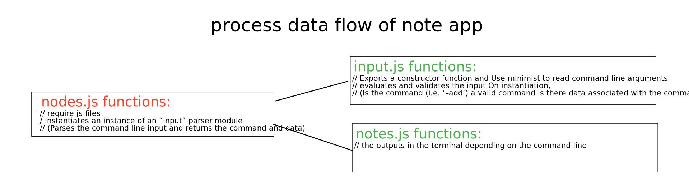

# notes App:
#### it is an app to add notes.
**NOTE:** you should use these command lines to install the requirments and dependencies:
```
npm init -y
```
```
npm i minimist
```
 and to add your note use this command line:
 ```
 node nodes.js --add "please add here your note"
 ```

 and here is the process data flow of note app:
 